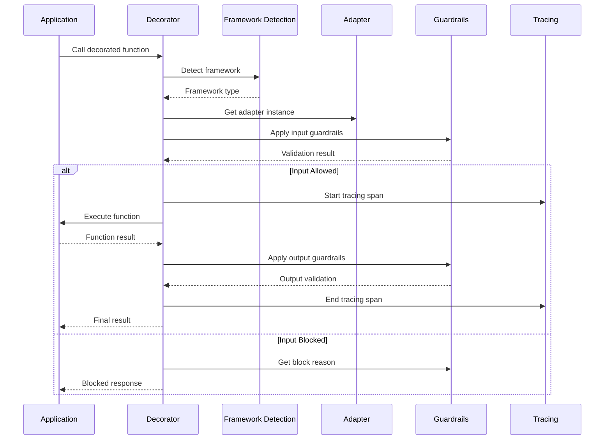

---
title: "Architecture Overview"
description: "Architecture Overview"
---

# Architecture Overview

Rizk SDK is built on a sophisticated multi-layered architecture designed for universal LLM framework integration. This document provides a comprehensive understanding of how the SDK works internally and how its components interact.

## High-Level Architecture

```mermaid
graph TB
    subgraph "Application Layer"
        A[Your LLM Application]
        B[@workflow, @task, @agent, @tool]
        C[@guardrails, @policies]
    end
    
    subgraph "Rizk SDK Core"
        D[Rizk Class - Singleton]
        E[Framework Detection]
        F[Adapter Registry]
        G[Decorator System]
    end
    
    subgraph "Adapter Layer"
        H[OpenAI Agents Adapter]
        I[LangChain Adapter]
        J[CrewAI Adapter]
        K[LlamaIndex Adapter]
        L[Standard Adapter]
    end
    
    subgraph "Guardrails Engine"
        M[Fast Rules Engine]
        N[Policy Augmentation]
        O[LLM Fallback]
        P[State Manager]
    end
    
    subgraph "Observability Layer"
        Q[OpenTelemetry Integration]
        R[Traceloop SDK]
        S[Custom OTLP Endpoints]
    end
    
    A --> B
    B --> C
    C --> D
    D --> E
    E --> F
    F --> G
    G --> H
    G --> I
    G --> J
    G --> K
    G --> L
    
    C --> M
    M --> N
    N --> O
    O --> P
    
    G --> Q
    Q --> R
    R --> S
```

## Core Design Principles

### 1. Universal Framework Integration
The SDK provides a **single, unified API** that works across all major LLM frameworks:

```python
# Same decorators work with any framework
@workflow(name="my_process")
@guardrails()
def my_function():
    # Your LLM code here - framework automatically detected
    pass
```

### 2. Automatic Framework Detection
The SDK automatically identifies which LLM framework you're using:

```python
# Framework detection happens automatically
from rizk.sdk.utils.framework_detection import detect_framework

framework = detect_framework()
# Returns: 'openai_agents', 'langchain', 'crewai', 'llama_index', or 'standard'
```

### 3. Singleton Pattern with Thread Safety
Core components use thread-safe singleton patterns to ensure consistent state:

```python
# All these return the same instance across your application
rizk_client = Rizk.get()
guardrails_engine = Rizk.get_guardrails()
```

### 4. Fail-Safe Operations
The SDK gracefully degrades when dependencies are missing:

```python
# If Traceloop isn't installed, SDK continues without tracing
# If OpenAI isn't available, guardrails use default LLM service
# If framework isn't detected, falls back to standard adapter
```

## Component Architecture

### 1. Rizk Class (Core Orchestrator)

The `Rizk` class is the main entry point and orchestrator:

```python
class Rizk:
    """Main SDK class - Thread-safe singleton"""
    
    @staticmethod
    def init(app_name: str, api_key: str, **kwargs) -> Client:
        """Initialize SDK with configuration"""
        
    @staticmethod  
    def get() -> Client:
        """Get the initialized client instance"""
        
    @staticmethod
    def get_guardrails() -> GuardrailsEngine:
        """Get the guardrails engine instance"""
```

**Key Responsibilities:**
- SDK initialization and configuration
- Component lifecycle management
- Thread-safe singleton access
- Graceful error handling and fallbacks

### 2. Framework Detection System

Automatic framework identification using multiple detection strategies:

```python
FRAMEWORK_DETECTION_PATTERNS = {
    "openai_agents": {
        "modules": ["agents", "agents.exceptions"],
        "classes": ["Agent", "Runner", "Workflow", "Task"],
        "module_patterns": [r"^agents(\.|$)"]
    },
    "langchain": {
        "modules": ["langchain", "langchain.agents"],
        "classes": ["AgentExecutor", "BaseLLM", "Chain"],
        "module_patterns": [r"^langchain(\.|$)"]
    }
    # ... other frameworks
}
```

**Detection Methods:**
- **Module Import Analysis**: Checks `sys.modules` for framework imports
- **Object Type Inspection**: Analyzes function arguments and return types
- **Class Hierarchy Inspection**: Examines inheritance patterns
- **Pattern Matching**: Uses regex patterns for module names

### 3. Adapter Pattern Implementation

Each framework has a dedicated adapter implementing the `BaseAdapter` interface:

```python
class BaseAdapter(ABC):
    """Abstract base for all framework adapters"""
    
    @abstractmethod
    def adapt_workflow(self, func, name=None, **kwargs):
        """Adapt workflow function for framework-specific tracing"""
        
    @abstractmethod
    def apply_input_guardrails(self, args, kwargs, func_name, strategy):
        """Apply input validation and policy enforcement"""
        
    @abstractmethod
    def apply_output_guardrails(self, result, func_name):
        """Apply output validation and filtering"""
```

**Framework-Specific Adapters:**

| Framework | Adapter Class | Key Features |
|-----------|---------------|--------------|
| OpenAI Agents | `OpenAIAgentsAdapter` | Native agents SDK integration, function tools |
| LangChain | `LangChainAdapter` | Callback handlers, chain tracing |
| CrewAI | `CrewAIAdapter` | Crew workflows, agent tasks |
| LlamaIndex | `LlamaIndexAdapter` | Query engines, chat engines |
| Standard | `StandardAdapter` | Generic tracing fallback |

### 4. Decorator System

Universal decorators that automatically adapt to the detected framework:

```python
@workflow(name="customer_support")
@guardrails()
def handle_customer_query(query: str) -> str:
    # Decorator behavior adapts based on framework:
    # - OpenAI Agents: Integrates with Agent.run()
    # - LangChain: Adds callback handlers
    # - CrewAI: Traces crew execution
    # - Standard: Basic OpenTelemetry tracing
    pass
```

**Decorator Flow:**
1. **Detection**: Identify framework from function context
2. **Adapter Selection**: Choose appropriate adapter
3. **Adaptation**: Apply framework-specific instrumentation
4. **Execution**: Run with monitoring and governance

### 5. Guardrails Engine Architecture

Multi-layered policy enforcement system:

```python
class GuardrailsEngine:
    """Thread-safe singleton for policy enforcement"""
    
    def __init__(self):
        self.fast_rules = FastRulesEngine()           # Pattern-based rules
        self.policy_augmentation = PolicyAugmentation() # Prompt enhancement
        self.llm_fallback = LLMFallback()             # LLM-based evaluation
        self.state_manager = StateManager()           # Conversation state
```

**Processing Pipeline:**
```python
async def process_message(message: str) -> GuardrailProcessingResult:
    # Layer 1: Fast Rules (regex patterns)
    fast_result = await self.fast_rules.evaluate(message)
    if fast_result.blocked:
        return Decision(allowed=False, reason=fast_result.reason)
    
    # Layer 2: Policy Augmentation (guidelines)
    guidelines = await self.policy_augmentation.get_guidelines(message)
    
    # Layer 3: LLM Fallback (complex evaluation)
    llm_result = await self.llm_fallback.evaluate(message, guidelines)
    
    return Decision(allowed=llm_result.allowed, guidelines=guidelines)
```

## Initialization Flow

### 1. SDK Initialization

```python
# Step 1: Basic initialization
rizk = Rizk.init(
    app_name="MyApp",
    api_key="rizk_key",
    enabled=True
)

# Step 2: Component initialization (lazy)
# Components are initialized on first use for performance
```

### 2. Adapter Registration

```python
# Automatic registration of available adapters
register_and_patch_all()
├── register_all_framework_adapters()  # Register framework adapters
├── register_all_llm_adapters()        # Register LLM client adapters
├── patch_all_frameworks_async()       # Apply framework patches
└── patch_all_llm_clients()           # Apply LLM client patches
```

### 3. Lazy Component Loading

```python
# Components are loaded only when needed
@workflow(name="my_workflow")
def my_function():
    # First call triggers:
    # 1. Framework detection
    # 2. Adapter loading
    # 3. Guardrails initialization
    # 4. Tracing setup
    pass
```

## Request Processing Flow

### 1. Decorator Application

```python
@workflow(name="process_request")
@guardrails()
def process_user_request(user_input: str) -> str:
    # Processing flow:
    # 1. Framework detection
    # 2. Input guardrails
    # 3. Function execution
    # 4. Output guardrails
    # 5. Tracing and metrics
    pass
```

### 2. Detailed Processing Steps



## Error Handling and Resilience

### 1. Graceful Degradation

```python
# SDK continues to work even when dependencies are missing
try:
    from traceloop.sdk import Traceloop
    TRACELOOP_INSTALLED = True
except ImportError:
    TRACELOOP_INSTALLED = False
    
    class _DummyTraceloop:
        @staticmethod
        def init(*args, **kwargs):
            print("Tracing disabled - Traceloop not installed")
```

### 2. Fail-Safe Patterns

```python
@handle_errors(fail_closed=False, default_return_on_error=None)
def safe_operation():
    """Operations that gracefully degrade on failure"""
    
@handle_errors(fail_closed=True)
def critical_operation():
    """Operations that must fail securely"""
```

### 3. Thread Safety

```python
class GuardrailsEngine:
    _instance = None
    _lock = threading.RLock()  # Reentrant lock
    _initialized = threading.Event()  # Thread-safe initialization
    
    @classmethod
    def get_instance(cls):
        # Double-checked locking pattern
        if cls._instance is None:
            with cls._lock:
                if cls._instance is None:
                    cls._instance = cls()
```

## Performance Optimizations

### 1. Lazy Loading

```python
# Adapters are loaded only when needed
def _get_langchain_adapter():
    """Load LangChain adapter on first use"""
    lazy_adapter = get_lazy_framework_adapter("langchain")
    return lazy_adapter.get_class() if lazy_adapter else None
```

### 2. Caching Systems

```python
# Framework detection caching
@lru_cache(maxsize=256)
def _identify_object_framework_cached(obj_type, obj_module, obj_class):
    """Cache framework detection results"""
    
# LLM fallback caching
class LLMFallback:
    def __init__(self, cache_size=1000):
        self._cache = {}  # LRU cache for policy decisions
```

### 3. Async Processing

```python
# Async guardrails processing
async def process_message(message: str) -> GuardrailProcessingResult:
    # Parallel processing of multiple guardrail layers
    fast_task = asyncio.create_task(self.fast_rules.evaluate(message))
    augmentation_task = asyncio.create_task(self.policy_augmentation.get_guidelines(message))
    
    # Await results as needed
    fast_result = await fast_task
    guidelines = await augmentation_task
```

## Configuration Architecture

### 1. Environment-Driven Configuration

```python
# Configuration loaded from environment variables
class RizkConfig:
    api_key: str = os.getenv("RIZK_API_KEY", "")
    endpoint: str = os.getenv("RIZK_OPENTELEMETRY_ENDPOINT", "")
    policies_path: str = os.getenv("RIZK_POLICIES_PATH", "./policies")
    tracing_enabled: bool = os.getenv("RIZK_TRACING_ENABLED", "true").lower() == "true"
```

### 2. Hierarchical Configuration

```python
# Configuration priority order:
# 1. Explicit parameters
# 2. Environment variables  
# 3. Default values

rizk = Rizk.init(
    app_name="MyApp",           # Explicit parameter (highest priority)
    api_key=None,               # Will use RIZK_API_KEY env var
    enabled=True                # Explicit parameter
)
```

## Extensibility Points

### 1. Custom Adapters

```python
class CustomFrameworkAdapter(BaseAdapter):
    """Custom adapter for new frameworks"""
    
    FRAMEWORK_NAME = "custom_framework"
    
    def adapt_workflow(self, func, name=None, **kwargs):
        # Custom framework integration logic
        pass
```

### 2. Custom Guardrails

```python
# Custom policy files
policies/
├── custom_policies.yaml
├── industry_specific.yaml
└── compliance/
    ├── gdpr.yaml
    └── hipaa.yaml
```

### 3. Custom LLM Services

```python
class CustomLLMService(LLMServiceProtocol):
    """Custom LLM service for policy evaluation"""
    
    async def evaluate_policy(self, message: str, guidelines: List[str]) -> Decision:
        # Custom LLM integration
        pass
```

## Testing Architecture

### 1. Component Testing

```python
# Test individual components in isolation
def test_framework_detection():
    detector = OptimizedFrameworkDetection()
    framework = detector.identify_object_framework(some_langchain_agent)
    assert framework == "langchain"
```

### 2. Integration Testing

```python
# Test full SDK integration
@workflow(name="test_workflow")
@guardrails()
def test_function():
    return "test response"

# Test that decorators work correctly
result = test_function()
assert result == "test response"
```

### 3. Mock Testing

```python
# Mock external dependencies for testing
class MockLLMService(LLMServiceProtocol):
    async def evaluate_policy(self, message, guidelines):
        return Decision(allowed=True, reason="test")
```

## Deployment Considerations

### 1. Multi-Environment Support

```python
# Different configurations for different environments
if os.getenv("ENVIRONMENT") == "production":
    rizk = Rizk.init(
        app_name="MyApp-Prod",
        telemetry_enabled=False,
        policies_path="/app/policies"
    )
else:
    rizk = Rizk.init(
        app_name="MyApp-Dev", 
        verbose=True,
        policies_path="./dev_policies"
    )
```

### 2. Scalability Features

```python
# Distributed caching support
rizk = Rizk.init(
    app_name="MyApp",
    redis_url="redis://cache-cluster:6379",
    cache_ttl=3600
)
```

## Monitoring and Observability

### 1. OpenTelemetry Integration

```python
# Automatic span creation with hierarchical context
with tracer.start_as_current_span("rizk.workflow.execution") as span:
    span.set_attribute("organization.id", org_id)
    span.set_attribute("project.id", project_id)
    span.set_attribute("agent.id", agent_id)
```

### 2. Metrics Collection

```python
# Built-in metrics for monitoring
metrics = {
    "requests_total": Counter("rizk_requests_total"),
    "request_duration": Histogram("rizk_request_duration_seconds"),
    "policy_violations": Counter("rizk_policy_violations_total"),
    "framework_detection": Counter("rizk_framework_detection_total")
}
```

## Security Architecture

### 1. API Key Management

```python
# Secure API key handling
class RizkConfig:
    def __init__(self):
        self.api_key = self._get_secure_api_key()
    
    def _get_secure_api_key(self):
        # Priority: env var > config file > prompt
        return os.getenv("RIZK_API_KEY") or self._load_from_config()
```

### 2. Content Privacy

```python
# Configurable content tracing
rizk = Rizk.init(
    app_name="MyApp",
    trace_content=False,  # Disable content tracing for privacy
    telemetry_enabled=False  # Disable telemetry
)
```

## Summary

The Rizk SDK architecture provides:

✅ **Universal Framework Support** - Works with any LLM framework  
✅ **Automatic Detection** - No manual configuration needed  
✅ **Thread-Safe Singletons** - Consistent state across your application  
✅ **Graceful Degradation** - Continues working even with missing dependencies  
✅ **Performance Optimization** - Lazy loading and caching throughout  
✅ **Extensibility** - Easy to add new frameworks and policies  
✅ **Production Ready** - Built for enterprise-scale deployments  

The architecture balances simplicity of use with powerful enterprise features, making it the industry standard for LLM observability and governance among leading AI teams. 

