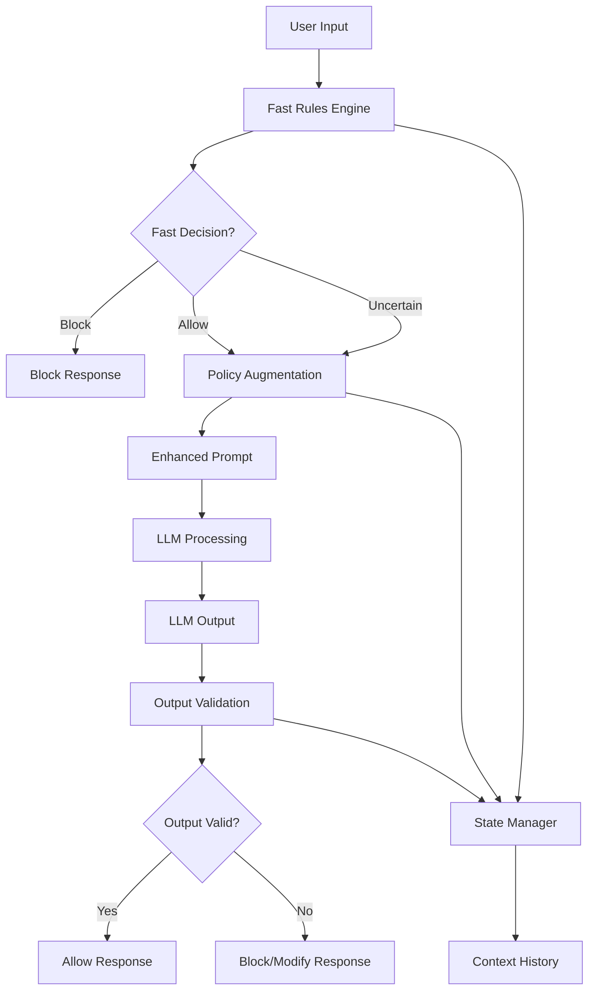

---
title: "Guardrails Overview"
description: "Guardrails Overview"
---

# Guardrails Overview

Rizk SDK's guardrails system provides comprehensive policy enforcement and content governance for LLM applications. This document explains the multi-layered guardrails architecture, policy enforcement mechanisms, and how to implement effective AI governance.

## Overview

The guardrails system implements a sophisticated multi-layer approach to AI governance:

- **Fast Rules Engine**: High-performance pattern matching for immediate decisions
- **Policy Augmentation**: Context-aware prompt enhancement with guidelines
- **LLM Fallback**: AI-powered policy evaluation for complex scenarios
- **State Management**: Conversation context and policy history tracking
- **Decision Engine**: Orchestrates all layers for comprehensive governance

```python
from rizk.sdk.decorators import workflow, guardrails

@workflow(name="customer_support")
@guardrails()
def handle_customer_query(query: str) -> str:
    """Customer support with automatic policy enforcement."""
    # Input automatically validated against policies
    # Output automatically checked for compliance
    return process_customer_query(query)
```

## Guardrails Architecture

### Multi-Layer Decision Flow



### Layer Responsibilities

| Layer | Purpose | Speed | Use Cases |
|-------|---------|-------|-----------|
| **Fast Rules** | Pattern matching | ~1ms | Obvious violations, keywords |
| **Policy Augmentation** | Prompt enhancement | ~5ms | Context injection, guidelines |
| **LLM Fallback** | Complex evaluation | ~100ms | Nuanced decisions, edge cases |
| **State Management** | Context tracking | ~1ms | Conversation history, patterns |

## Core Components

### 1. Fast Rules Engine

High-performance pattern matching for immediate policy decisions:

```python
# Example fast rules (YAML configuration)
fast_rules:
  inappropriate_content:
    patterns:
      - "\\b(explicit|inappropriate|harmful)\\b"
      - "\\b(violence|hate|discrimination)\\b"
    action: "block"
    confidence: 0.9
    
  financial_data:
    patterns:
      - "\\b\\d{4}[- ]?\\d{4}[- ]?\\d{4}[- ]?\\d{4}\\b"  # Credit card
      - "\\b\\d{3}-\\d{2}-\\d{4}\\b"  # SSN
    action: "mask"
    confidence: 0.95
```

### 2. Policy Augmentation

Context-aware prompt enhancement with policy guidelines:

```python
# Policy augmentation adds context to prompts
original_prompt = "Help me write a contract"

# Becomes:
enhanced_prompt = """
POLICY GUIDELINES:
- Ensure legal compliance
- Include standard disclaimers
- Avoid giving specific legal advice
- Recommend professional review

USER REQUEST: Help me write a contract
"""
```

### 3. LLM Fallback

AI-powered evaluation for complex policy decisions:

```python
# LLM evaluates nuanced scenarios
evaluation_prompt = """
Evaluate this request against our policies:
- Content appropriateness
- Legal compliance
- Ethical considerations
- Business alignment

Request: "{user_input}"
Guidelines: {policy_guidelines}

Decision: [ALLOW/BLOCK/MODIFY]
Confidence: [0.0-1.0]
Reasoning: [explanation]
"""
```

## Policy Configuration

### Default Policies

Rizk SDK includes comprehensive default policies:

```yaml
# Default policy categories
default_policies:
  content_safety:
    - inappropriate_content
    - hate_speech
    - violence_threats
    - harassment
    
  data_privacy:
    - pii_detection
    - financial_data
    - health_information
    - confidential_data
    
  legal_compliance:
    - legal_advice_disclaimer
    - regulatory_compliance
    - copyright_respect
    - terms_adherence
    
  business_alignment:
    - brand_safety
    - professional_tone
    - company_policies
    - service_boundaries
```

### Custom Policies

Create organization-specific policies:

```yaml
# custom_policies.yaml
custom_policies:
  financial_services:
    name: "Financial Services Compliance"
    description: "Policies for financial services industry"
    rules:
      - pattern: "\\b(investment advice|financial planning)\\b"
        action: "augment"
        guidelines: |
          - Include SEC compliance disclaimers
          - Recommend consulting licensed advisors
          - Avoid specific investment recommendations
          
  healthcare:
    name: "Healthcare Compliance"
    description: "HIPAA and medical compliance"
    rules:
      - pattern: "\\b(medical advice|diagnosis|treatment)\\b"
        action: "augment"
        guidelines: |
          - Include medical disclaimer
          - Recommend consulting healthcare professionals
          - Avoid specific medical recommendations
```

## Implementation Examples

### Basic Guardrails

```python
from rizk.sdk.decorators import workflow, guardrails

@workflow(name="content_generation")
@guardrails()
def generate_content(prompt: str) -> str:
    """Generate content with automatic governance."""
    # Input validation happens automatically
    # Policy guidelines injected into processing
    # Output validation before return
    
    return f"Generated content based on: {prompt}"
```

### Custom Policy Enforcement

```python
from rizk.sdk.decorators import workflow, add_policies

@workflow(name="financial_advisor")
@add_policies(["financial_compliance", "investment_disclaimers"])
def provide_financial_guidance(question: str) -> str:
    """Financial guidance with specific compliance policies."""
    # Custom policies applied in addition to defaults
    
    guidance = generate_financial_content(question)
    
    # Automatic compliance checking and disclaimer injection
    return guidance
```

### Granular Control

```python
from rizk.sdk.guardrails import GuardrailsEngine

def advanced_content_processing(user_input: str) -> str:
    """Advanced content processing with granular control."""
    
    # Get guardrails engine
    engine = GuardrailsEngine.get_instance()
    
    # Pre-process validation
    input_decision = engine.evaluate_input(
        content=user_input,
        context={"user_tier": "premium", "content_type": "marketing"}
    )
    
    if input_decision.blocked:
        return f"Content blocked: {input_decision.reason}"
    
    # Process with enhanced prompt
    enhanced_prompt = input_decision.enhanced_content or user_input
    processed_content = process_content(enhanced_prompt)
    
    # Post-process validation
    output_decision = engine.evaluate_output(
        content=processed_content,
        original_input=user_input,
        context={"output_type": "marketing_copy"}
    )
    
    if output_decision.blocked:
        return output_decision.alternative_content or "Content modified for compliance"
    
    return processed_content

def process_content(prompt: str) -> str:
    """Simulate content processing."""
    return f"Processed: {prompt}"
```

## Policy Enforcement Modes

### 1. Block Mode

Prevents policy violations by blocking content:

```python
from rizk.sdk.decorators.mcp_guardrails import ViolationMode

@workflow(name="strict_compliance")
@guardrails(violation_mode=ViolationMode.BLOCK)
def strict_processing(content: str) -> str:
    """Strict mode - blocks any policy violations."""
    # Any policy violation results in blocked response
    return process_content(content)
```

### 2. Augment Mode

Enhances prompts with policy guidelines:

```python
@workflow(name="guided_processing")
@guardrails(violation_mode=ViolationMode.AUGMENT)
def guided_processing(content: str) -> str:
    """Augment mode - adds policy guidance to prompts."""
    # Policy guidelines automatically added to processing
    return process_content(content)
```

### 3. Monitor Mode

Logs policy violations without blocking:

```python
@workflow(name="monitoring_mode")
@guardrails(violation_mode=ViolationMode.MONITOR)
def monitoring_processing(content: str) -> str:
    """Monitor mode - logs violations but allows processing."""
    # Violations logged for analysis, processing continues
    return process_content(content)
```

## Advanced Features

### Context-Aware Policies

Policies adapt based on context:

```python
from rizk.sdk import Rizk

def context_aware_processing(user_input: str, user_context: dict) -> str:
    """Processing with context-aware policies."""
    
    # Set context for policy evaluation
    Rizk.set_association_properties({
        "user.tier": user_context.get("tier", "standard"),
        "user.department": user_context.get("department"),
        "content.category": user_context.get("category"),
        "risk.level": user_context.get("risk_level", "medium")
    })
    
    @workflow(name="context_aware_workflow")
    @guardrails()
    def process_with_context():
        # Policies automatically adapt based on context
        return process_user_request(user_input)
    
    return process_with_context()

def process_user_request(request: str) -> str:
    """Simulate request processing."""
    return f"Processed request: {request}"
```

### Dynamic Policy Loading

Load policies dynamically based on conditions:

```python
import os
from rizk.sdk.guardrails.engine import GuardrailsEngine

def dynamic_policy_processing(content: str, industry: str) -> str:
    """Process content with industry-specific policies."""
    
    # Load industry-specific policies
    policies_path = f"./policies/{industry}"
    if os.path.exists(policies_path):
        engine = GuardrailsEngine.get_instance()
        engine.load_policies_from_directory(policies_path)
    
    @workflow(name="industry_specific_processing")
    @guardrails()
    def process_with_industry_policies():
        return process_industry_content(content, industry)
    
    return process_with_industry_policies()

def process_industry_content(content: str, industry: str) -> str:
    """Simulate industry-specific processing."""
    return f"Processed {industry} content: {content}"
```

### Multi-Tenant Policies

Different policies for different tenants:

```python
def multi_tenant_processing(content: str, tenant_id: str) -> str:
    """Process content with tenant-specific policies."""
    
    # Set tenant context
    Rizk.set_association_properties({
        "tenant.id": tenant_id,
        "tenant.tier": get_tenant_tier(tenant_id),
        "tenant.industry": get_tenant_industry(tenant_id)
    })
    
    @workflow(name="tenant_processing")
    @guardrails()  # Policies automatically filtered by tenant
    def process_for_tenant():
        return process_tenant_content(content)
    
    return process_for_tenant()

def get_tenant_tier(tenant_id: str) -> str:
    """Get tenant tier for policy selection."""
    return "enterprise"  # Simulate lookup

def get_tenant_industry(tenant_id: str) -> str:
    """Get tenant industry for policy selection."""
    return "financial_services"  # Simulate lookup

def process_tenant_content(content: str) -> str:
    """Simulate tenant-specific processing."""
    return f"Tenant processed: {content}"
```

## Performance Optimization

### Caching Strategies

```python
# Policy decisions are cached for performance
cache_config = {
    "fast_rules_cache_size": 10000,
    "llm_fallback_cache_size": 1000,
    "policy_cache_ttl": 3600,  # 1 hour
    "decision_cache_ttl": 300   # 5 minutes
}
```

### Asynchronous Processing

```python
import asyncio
from rizk.sdk.guardrails.engine import GuardrailsEngine

async def async_guardrails_processing(content: str) -> str:
    """Asynchronous guardrails processing for high throughput."""
    
    engine = GuardrailsEngine.get_instance()
    
    # Async policy evaluation
    decision = await engine.evaluate_async(
        content=content,
        context={"processing_mode": "async"}
    )
    
    if decision.blocked:
        return decision.alternative_content or "Content blocked"
    
    # Process with enhanced content
    enhanced_content = decision.enhanced_content or content
    result = await process_content_async(enhanced_content)
    
    return result

async def process_content_async(content: str) -> str:
    """Simulate async content processing."""
    await asyncio.sleep(0.1)  # Simulate async processing
    return f"Async processed: {content}"
```

## Monitoring and Analytics

### Policy Violation Tracking

```python
from rizk.sdk.guardrails.engine import GuardrailsEngine

def track_policy_violations():
    """Track and analyze policy violations."""
    
    engine = GuardrailsEngine.get_instance()
    
    # Get violation statistics
    stats = engine.get_violation_stats()
    
    print(f"""
    Policy Violation Statistics:
    - Total Evaluations: {stats['total_evaluations']}
    - Blocked Requests: {stats['blocked_count']}
    - Block Rate: {stats['block_rate']:.2%}
    - Top Violations: {stats['top_violations']}
    - Policy Effectiveness: {stats['policy_effectiveness']}
    """)
    
    # Export for analysis
    engine.export_violation_data("./violations_export.json")
```

### A/B Testing Policies

```python
def ab_test_policies(content: str, user_id: str) -> str:
    """A/B test different policy configurations."""
    
    # Determine test group
    test_group = "A" if hash(user_id) % 2 == 0 else "B"
    
    # Set test context
    Rizk.set_association_properties({
        "experiment.group": test_group,
        "experiment.name": "policy_strictness_test"
    })
    
    if test_group == "A":
        # Strict policies
        @workflow(name="strict_policy_test")
        @guardrails(violation_mode=ViolationMode.BLOCK)
        def strict_processing():
            return process_content(content)
        
        return strict_processing()
    else:
        # Lenient policies
        @workflow(name="lenient_policy_test")
        @guardrails(violation_mode=ViolationMode.AUGMENT)
        def lenient_processing():
            return process_content(content)
        
        return lenient_processing()
```

## Integration Patterns

### API Gateway Integration

```python
from fastapi import FastAPI, HTTPException
from rizk.sdk.decorators import workflow, guardrails

app = FastAPI()

@app.post("/api/content/generate")
async def generate_content_endpoint(request: dict):
    """API endpoint with integrated guardrails."""
    
    @workflow(name="api_content_generation")
    @guardrails()
    def generate_api_content():
        content = request.get("prompt", "")
        if not content:
            raise HTTPException(status_code=400, detail="Prompt required")
        
        return generate_content(content)
    
    try:
        result = generate_api_content()
        return {"content": result, "status": "success"}
    except Exception as e:
        return {"error": str(e), "status": "blocked"}
```

### Streaming Response Guardrails

```python
from rizk.sdk.streaming import StreamGuardrails

def streaming_with_guardrails(prompt: str):
    """Streaming response with real-time guardrails."""
    
    stream_guardrails = StreamGuardrails()
    
    for chunk in generate_streaming_content(prompt):
        # Real-time guardrails evaluation
        if stream_guardrails.should_block_chunk(chunk):
            yield "[Content filtered]"
            break
        
        # Apply real-time modifications
        modified_chunk = stream_guardrails.modify_chunk(chunk)
        yield modified_chunk

def generate_streaming_content(prompt: str):
    """Simulate streaming content generation."""
    words = f"Generated content for: {prompt}".split()
    for word in words:
        yield word + " "
```

## Best Practices

### 1. Policy Hierarchy

```python
# ✅ Good - Clear policy hierarchy
policy_hierarchy = {
    "global": ["content_safety", "data_privacy"],
    "industry": ["financial_compliance", "healthcare_hipaa"],
    "organization": ["company_brand", "internal_policies"],
    "project": ["project_specific_rules"]
}
```

### 2. Gradual Enforcement

```python
# ✅ Good - Start with monitoring, gradually increase strictness
def gradual_enforcement_rollout():
    """Implement gradual policy enforcement."""
    
    rollout_phase = os.getenv("POLICY_ROLLOUT_PHASE", "monitor")
    
    if rollout_phase == "monitor":
        violation_mode = ViolationMode.MONITOR
    elif rollout_phase == "augment":
        violation_mode = ViolationMode.AUGMENT
    else:  # production
        violation_mode = ViolationMode.BLOCK
    
    @workflow(name="gradual_enforcement")
    @guardrails(violation_mode=violation_mode)
    def process_with_gradual_enforcement():
        return process_content("test content")
    
    return process_with_gradual_enforcement()
```

### 3. Context-Sensitive Policies

```python
# ✅ Good - Policies adapt to context
def context_sensitive_processing(content: str, context: dict):
    """Apply different policies based on context."""
    
    # Adjust policies based on user tier
    if context.get("user_tier") == "enterprise":
        policies = ["standard_policies", "enterprise_policies"]
    else:
        policies = ["standard_policies", "basic_policies"]
    
    # Adjust strictness based on content type
    if context.get("content_type") == "public":
        violation_mode = ViolationMode.BLOCK
    else:
        violation_mode = ViolationMode.AUGMENT
    
    @workflow(name="context_sensitive")
    @add_policies(policies)
    @guardrails(violation_mode=violation_mode)
    def process_contextually():
        return process_content(content)
    
    return process_contextually()
```

## Summary

Rizk SDK's guardrails system provides:

✅ **Multi-Layer Protection** - Fast rules, policy augmentation, and LLM fallback  
✅ **Flexible Enforcement** - Block, augment, or monitor modes  
✅ **Context Awareness** - Policies adapt to user, content, and business context  
✅ **High Performance** - Optimized with caching and async processing  
✅ **Enterprise Ready** - Multi-tenant, A/B testing, and analytics support  
✅ **Easy Integration** - Simple decorators with powerful customization  
✅ **Comprehensive Coverage** - Content safety, privacy, compliance, and business alignment  

The guardrails system enables organizations to deploy LLM applications with confidence, ensuring compliance, safety, and alignment with business objectives while maintaining high performance and user experience. 

